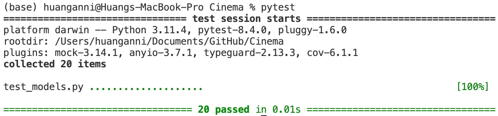

# Cinema Booking System

A simple command-line cinema seat booking system in Python. This project allows users to:

- Set up a cinema with a custom movie title, number of rows, and seats per row
- Book tickets (with default or custom seat selection)
- Check bookings by booking ID
- Cancel bookings
- View a visual seating chart

## Features
- **Seat selection:** Default (best available) or custom (user-specified)
- **Booking ID management:** Unique, reusable booking IDs
- **User-friendly errors:** Handles invalid input and booking errors gracefully
- **Unit tests:** Comprehensive test coverage for core logic and CLI

## Project Structure

```
Cinema/
├── __init__.py
├── main.py           # main console application logic
├── models.py         # Cinema, booking, and error classes
├── requirements.txt  # Python dependencies
├── test_models.py    # Unit tests for models.py
├── README.md         # Documentation
└── .gitignore        # Git ignore rules
```

## Getting Started

### 1. Clone the repository
```sh
git clone <your-repo-url>
cd Cinema
```

### 2. Set up and activate a virtual environment (recommended)
#### MAC/Linux
```sh
python3 -m venv .venv
source .venv/bin/activate 
```
#### Windows
```sh
python -m venv .venv
.venv\Scripts\activate.bat
```

### 3. Install dependencies
```sh
pip install -r requirements.txt
```

### 4. Run the application
```sh
python -m main
```

### 5. Run the tests
From the parent directory (to support relative imports):
```sh
pytest
```


## Usage
- Follow the prompts to set up the cinema and book tickets.
- You can check or cancel bookings using the booking ID provided after reservation.

## Customization
- Modify `models.py` to change seat selection logic or booking rules.
- Extend `main.py` for more CLI features.

## Example usage
```
(base) huanganni@Huangs-MacBook-Pro Cinema % /opt/homebrew/bin/python3 /Users/huangann
i/Documents/GitHub/Cinema/main.py
Enter movie title, number of rows, and seats per row (separated by space):
>guivigu 8 10
Welcome to GIC Cinemas!
[1] Book Tickets
[2] Check Booking
[3] Exit
Select an option (1-3):
>1
Enter number of tickets:
>10

Successfully reserved 10 guivigu tickets.
Booking ID: GIC0001
Selected seats:
                   S C R E E N              
--------------------------------------------
H      .   .   .   .   .   .   .   .   .   .
G      .   .   .   .   .   .   .   .   .   .
F      .   .   .   .   .   .   .   .   .   .
E      .   .   .   .   .   .   .   .   .   .
D      .   .   .   .   .   .   .   .   .   .
C      .   .   .   .   .   .   .   .   .   .
B      .   .   .   .   .   .   .   .   .   .
A      O   O   O   O   O   O   O   O   O   O
       1   2   3   4   5   6   7   8   9  10
Press Enter to accept default, or enter seat position (e.g., A5):
>B5

Booking ID: GIC0001
Selected seats:
                   S C R E E N              
--------------------------------------------
H      .   .   .   .   .   .   .   .   .   .
G      .   .   .   .   .   .   .   .   .   .
F      .   .   .   .   .   .   .   .   .   .
E      .   .   .   .   .   .   .   .   .   .
D      .   .   .   .   .   .   .   .   .   .
C      .   .   .   O   O   O   O   .   .   .
B      .   .   .   .   O   O   O   O   O   O
A      .   .   .   .   .   .   .   .   .   .
       1   2   3   4   5   6   7   8   9  10
Press Enter to accept this selection, or enter another seat position:
>
Booking ID: GIC0001 confirmed.
Welcome to GIC Cinemas!
[1] Book Tickets
[2] Check Booking
[3] Exit
Select an option (1-3):
>2
Enter your booking ID:
>GIC001
Invalid booking ID. Please check and try again.
Welcome to GIC Cinemas!
[1] Book Tickets
[2] Check Booking
[3] Exit
Select an option (1-3):
>2
Enter your booking ID:
>GIC0001
Booking id: GIC0001
Selected seats:
                   S C R E E N              
--------------------------------------------
H      .   .   .   .   .   .   .   .   .   .
G      .   .   .   .   .   .   .   .   .   .
F      .   .   .   .   .   .   .   .   .   .
E      .   .   .   .   .   .   .   .   .   .
D      .   .   .   .   .   .   .   .   .   .
C      .   .   .   #   #   #   #   .   .   .
B      .   .   .   .   #   #   #   #   #   #
A      .   .   .   .   .   .   .   .   .   .
       1   2   3   4   5   6   7   8   9  10
Welcome to GIC Cinemas!
[1] Book Tickets
[2] Check Booking
[3] Exit
Select an option (1-3):
>1
Enter number of tickets:
>10

Successfully reserved 10 guivigu tickets.
Booking ID: GIC0002
Selected seats:
                   S C R E E N              
--------------------------------------------
H      .   .   .   .   .   .   .   .   .   .
G      .   .   .   .   .   .   .   .   .   .
F      .   .   .   .   .   .   .   .   .   .
E      .   .   .   .   .   .   .   .   .   .
D      .   .   .   .   .   .   .   .   .   .
C      .   .   .   #   #   #   #   .   .   .
B      .   .   .   .   #   #   #   #   #   #
A      O   O   O   O   O   O   O   O   O   O
       1   2   3   4   5   6   7   8   9  10
Press Enter to accept default, or enter seat position (e.g., A5):
>D7 

Booking ID: GIC0002
Selected seats:
                   S C R E E N              
--------------------------------------------
H      .   .   .   .   .   .   .   .   .   .
G      .   .   .   .   .   .   .   .   .   .
F      .   .   .   .   .   .   .   .   .   .
E      .   .   O   O   O   O   O   O   .   .
D      .   .   .   .   .   .   O   O   O   O
C      .   .   .   #   #   #   #   .   .   .
B      .   .   .   .   #   #   #   #   #   #
A      .   .   .   .   .   .   .   .   .   .
       1   2   3   4   5   6   7   8   9  10
Press Enter to accept this selection, or enter another seat position:
>G7

Booking ID: GIC0002
Selected seats:
                   S C R E E N              
--------------------------------------------
H      .   .   O   O   O   O   O   O   .   .
G      .   .   .   .   .   .   O   O   O   O
F      .   .   .   .   .   .   .   .   .   .
E      .   .   .   .   .   .   .   .   .   .
D      .   .   .   .   .   .   .   .   .   .
C      .   .   .   #   #   #   #   .   .   .
B      .   .   .   .   #   #   #   #   #   #
A      .   .   .   .   .   .   .   .   .   .
       1   2   3   4   5   6   7   8   9  10
Press Enter to accept default, or enter seat position (e.g., A5):
>F6

Booking ID: GIC0002
Selected seats:
                   S C R E E N              
--------------------------------------------
H      .   .   .   .   .   .   .   .   .   .
G      .   .   O   O   O   O   O   .   .   .
F      .   .   .   .   .   O   O   O   O   O
E      .   .   .   .   .   .   .   .   .   .
D      .   .   .   .   .   .   .   .   .   .
C      .   .   .   #   #   #   #   .   .   .
B      .   .   .   .   #   #   #   #   #   #
A      .   .   .   .   .   .   .   .   .   .
       1   2   3   4   5   6   7   8   9  10
Press Enter to accept this selection, or enter another seat position:
>
Booking ID: GIC0002 confirmed.
Welcome to GIC Cinemas!
[1] Book Tickets
[2] Check Booking
[3] Exit
Select an option (1-3):
>2
Enter your booking ID:
>GIC0002 
Booking id: GIC0002
Selected seats:
                   S C R E E N              
--------------------------------------------
H      .   .   .   .   .   .   .   .   .   .
G      .   .   #   #   #   #   #   .   .   .
F      .   .   .   .   .   #   #   #   #   #
E      .   .   .   .   .   .   .   .   .   .
D      .   .   .   .   .   .   .   .   .   .
C      .   .   .   #   #   #   #   .   .   .
B      .   .   .   .   #   #   #   #   #   #
A      .   .   .   .   .   .   .   .   .   .
       1   2   3   4   5   6   7   8   9  10
Welcome to GIC Cinemas!
[1] Book Tickets
[2] Check Booking
[3] Exit
Select an option (1-3):
>3
Thank you for using GIC Cinemas. Bye!
```

## License
MIT License

---

*Created for educational and demonstration purposes.*
